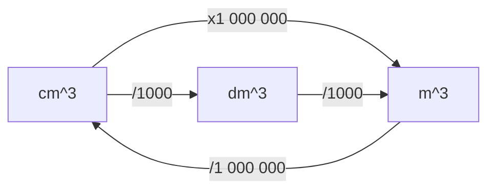

Specification reference: [[OCR A Chemistry Specification#Calculation of reacting masses, gas volumes and mole concentrations|Gas volumes]]

#### Gas volume at room temperature and pressure
Equal volumes of gases at the same temperature and pressure contain equal numbers of molecules.

At room temperature (25 degrees C) and standard atmospheric pressure (101 kPa), 1 mole of any gas occupies approximately $24 \text{ dm}^3$. This is known as the molar gas volume at RTP, $V_m$.

>[!INFO] Equation for gas volume
>At room temperature and pressure, the following equation describes the relationship between moles $n$, volume of gas $V$ and the molar gas volumes $V_m$.
> $$n = \frac{V}{V_{m}}, \quad V_{m}= 24 \text{ dm}^{3}\text{ at RTP}$$
#### Ideal gas law

##### Deriving the ideal gas equation
 - The volume of a gas will **increase** if temperature ($T$) increases.
- The volume of a gas will **decrease** if pressure ($p$) increases.
- The volume of a gas will **increase** if the number of moles ($n$) of gas increases.

Therefore, the volume of gas could be expressed as such:

$$
\begin{aligned}
V &\propto \frac{nT}{p}\\[3mm]
V &= k \times \frac{nT}{p} \\[3mm]
pV &= k \times nT, \quad \text{where k is a constant}
\end{aligned}
$$

Instead of $k$, we use the ideal gas constant, $R$, which is equal to $8.314$ and its units are  $\text{J mol}^{-1}\text{ K}^{-1}$
##### Ideal gas equation
The relationship between:
- Volume of gas ($V$) in $m^3$
- Pressure ($p$) in $Pa$
- Moles ($n$) in $\text{mol}$
- The ideal gas constant $R$, $8.314 \text{ J mol}^{-1}\text{ K}^{-1}$
- Temperature ($T$) in $K$ (equal to **degrees Celsius + 273**)

is expressed in the **ideal gas equation**:
 $$
 pV = nRT
 $$
 
> [!QUESTION]+ Why is it known as the *ideal* gas law?
> The ideal gas law makes a set of assumptions about gases which may not be true in the real world. Therefore the values produced by the equation are for an *ideal*, calculated gas.
> - They are in continuous, random, motion.
 >- They do not experience any intermolecular forces.
> - They exert pressure upon collision with each other and with the walls of the container.
> - Kinetic energy is not lost during collisions because collisions are elastic.
> - As gas molecules are so small they can be assumed to be the same size regardless of type of gas molecule.

##### Conversions for the ideal gas equation

- 1 kPA = 1000 Pa
- 1 atm = 101,000 Pa
- 0 °C = 273 K

